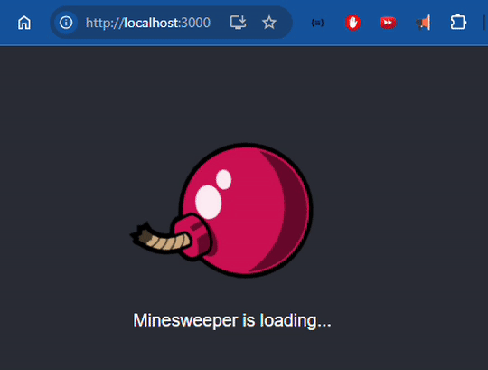

# stage-1-of-5-minesweeper-is-loaded | [readme](../readme.md)

## [Minesweeper is loading...](https://hyperskill.org/projects/108/stages/586/implement)

### My actions
* [setup react project](./setup-react-project.md)
* edit [index.html](../minesweeper/public/index.html)
  * add the following to the `<head>...</head>`
    ```html
    <link rel="preconnect" href="https://fonts.googleapis.com">
    <link rel="preconnect" href="https://fonts.gstatic.com" crossorigin>
    <link href="https://fonts.googleapis.com/css2?family=Roboto:ital,wght@0,100;0,300;0,400;0,500;0,700;0,900;1,100;1,300;1,400;1,500;1,700;1,900&display=swap" rel="stylesheet">
    ```
* edit [App.js](../minesweeper/src/App.js)
  * clear out original
  * change import for logo to: `import logo from './bomb.svg';`
  * add line `<p>Minesweeper is loading...</p>`
* edit [App.test.js]
  * look for string `Minesweeper is loading...`
  ```javascript
  test('renders learn react link', () => {
  render(<App />);
  const linkElement = screen.getByText(/Minesweeper is loading.../i);
  expect(linkElement).toBeInTheDocument();
});
  * run the tests:
  ```
  * run test: `npm run test`
  ```
* output [http://localhost:3000](http://localhost:3000)



### Description
To complete this stage, you need to have _node.js_ installed on your computer. If you have not done so yet, please install it.

Welcome to the first stage! You have a default React app, which was generated by the command `npx create-react-app appName` (Actual: `npx create-react-app minesweeper`). To get comfortable with the structure of the React project, modify the code so that the app shows that Minesweeper is loading.

Figure out how to change the text and the picture on the page, then put up the text _"Minesweeper is loading..."_, and replace the React logo with something more suitable, like a picture of a [`bomb`](https://stepik.org/media/attachments/lesson/360753/bomb.svg). Don’t break the rotation of the picture and make sure that there's no other text on the page. Finally, change the font of the text: you can choose anything you like from [`Google fonts`](https://fonts.google.com/).

After completing the first stage, you can open the app in your browser and admire the beautiful loading page with an infinitely rotating picture!

Your intermediate solution can be compiled and run in a browser using the `npm start` command in the WebStorm terminal, to stop the server use `Ctrl+C`.

### Objectives
* Change the React logo to another picture
* Add the text _**"Minesweeper is loading..."**_
* Change the font


---
### Add to `<head>` of index.html
* for google font Rototo
```
    <link rel="preconnect" href="https://fonts.googleapis.com">
    <link rel="preconnect" href="https://fonts.gstatic.com" crossorigin>
    <link href="https://fonts.googleapis.com/css2?family=Roboto:ital,wght@0,100;0,300;0,400;0,500;0,700;0,900;1,100;1,300;1,400;1,500;1,700;1,900&display=swap" rel="stylesheet">

```

###  Adjust `App.css` - add font-family
```
.App-header {
  background-color: #282c34;
  min-height: 100vh;
  display: flex;
  flex-direction: column;
  align-items: center;
  justify-content: center;
  font-size: calc(10px + 2vmin);
  color: white;
  font-family: "Roboto", sans-serif;
}

```

### Adjust App.js
```
import reactlogo from './logo.svg';
import logo from './bomb.svg';
import './App.css';

function App() {
  return (
    <div className="App">
      <header className="App-header">
        
        <p>
        Minesweeper is loading...
        </p>
      </header>
    </div>
  );
}

export default App;

```