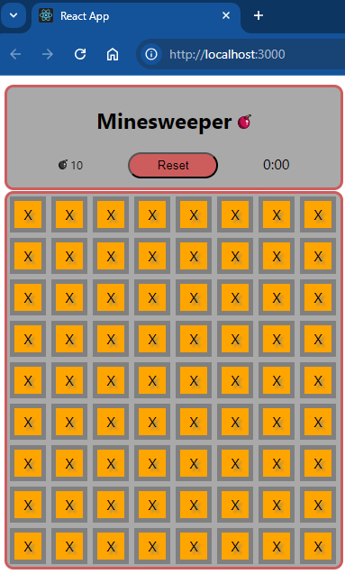

# stage-2-of-5-are-you-a-designer | [readme](../readme.md)

## Submitted and Passed

## [Are you a designer?](https://hyperskill.org/projects/108/stages/587/implement)

### Description
In this stage, you are going to create all the components of the game. Don’t be scared: here, you will be working only on the visuals! Before you get to work, make sure that you know how to create functional components and use props: you may consult the [React library official website](https://reactjs.org/docs/components-and-props.html) if you need to learn or refresh something. Your task is to decide how to break down the game into parts, that is, the components of your app, then use _JSX_ to describe it, and make the game look nice.

Let’s think about what elements we need in our game. First of all, you need a playing **field**: let it contain 8 columns and 9 rows. Position the cells to form straight rows and columns: give a `className` to the whole field and `className="cell"` to all cells, then you can easily position them with `display flex`. Note: since there are a lot of similar objects, it’s better to use `map()` instead of hard code. Check out an [article on lists and keys](https://reactjs.org/docs/lists-and-keys.html) to learn how to do it.

Remember, the player needs to find all the mines to win the game, so let's make a **flag counter** that will keep track of the remaining unflagged mines. At the beginning of the game, there are 10 unflagged mines.

Following the original version of Minesweeper, let's also add a **reset button** and a **timer**. Don't forget that when the game hasn’t started yet, the timer should show 0:00. The reset button should be the only element on which the cursor changes into a pointer.

Great, we have listed the elements of the game! The app should also have a [component hierarchy](https://reactjs.org/docs/thinking-in-react.html): figure out which components will determine the content of others and how you will pass props. You can decide on the structure by yourself, or use the recommended plan:

The final touch is to add the name **"Minesweeper"** and improve the game's looks by styling it. For example, you can put a picture near the name and play with colors. Flex your imagination and be creative!

As a result, you’ll see the Minesweeper game that does not work... for now.

Your intermediate solution can be compiled and run in a browser using the `npm start` command in the WebStorm terminal, to stop the server use `Ctrl+C`.

### Objectives
* Implement components:
* Field 8x9
* Flag counter equal to 10
* Reset button
* Timer at 0:00
* Components and the hierarchy
* Add CSS