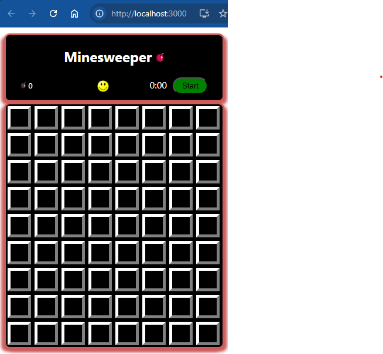

# stage-3-of-5-the-main-characters-cells | [readme](../readme.md)

### [Stage 3/5: The main characters: cells.](https://hyperskill.org/projects/108/stages/588/implement)

### My understanding of Minesweeper in this stage | [rules](https://www.gamesver.com/minesweeper-explained-how-to-play-rules/)
When you start a game, the field is blank. You see an 8x9 grid of `unmodified` cells.
An empty cell has no decoration - so is black. A cell may be in one of the following states:
* unmodified (starting state)
* empty (no bomb and unflagged)
* flagged (right-clicked)
* mine (you clicked on a mine, game over - you lost) 

## Submitted and Passed

### Description
A good application is a working application, so let's get ours to work! We'll start with the fundamental parts: the cells. The player should be able to open any cell by clicking it, or flag it with a right-click. To make this possible, you need to [add a state](https://reactjs.org/docs/state-and-lifecycle.html). Store the array that contains information about the field; make a function for creating an initial array with the placed mines. Remember that each time, the game field should be different, that is, the function should place mines at random.

Reminder: not only one component can have a state, so think about every piece of data and which component is responsible for it.

Then, you need to take care of [conditional rendering](https://reactjs.org/docs/conditional-rendering.html) because you need to distinguish between the cells with different statuses. Understand how to [handle events](https://reactjs.org/docs/handling-events.html), and do it for opening and flagging cells. To show these changes, you should have styles for the closed, opened, and flagged cells. Add contrasting borders or change the background color for the opened cells, and mark the flagged cells with a [flag](https://stepik.org/media/attachments/lesson/360753/target.svg)/[mine](https://stepik.org/media/attachments/lesson/360753/fired.svg) image. Here, you can apply your knowledge about box-shadow!

If you change the cell status, the state of the field should be changed, too; implement the methods that will do it! You can use [passing functions to components](https://reactjs.org/docs/faq-functions.html) here and read about _execution context_ in JavaScript.

For testing purposes, each cell should have `className="cell"`. In case you need to use another className, you should concatenate it with the required one, for example: `className="cell fired"`.

Your intermediate solution can be compiled and run in a browser using the npm start command in the WebStorm terminal, to stop the server use `Ctrl+C`.

### Objectives
1. State to store the situation on the field
2. Functions to set the initial field and change it
3. Conditional rendering of cells
4. Event listeners for cells
5. Add required CSS