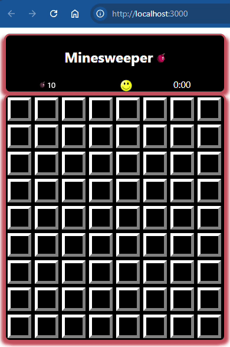

# stage-4-of-5-functionality | [readme](../readme.md)

## [Stage 4/5:Functionality](https://hyperskill.org/projects/108/stages/589/implement)

### Tasks
* DONE: convert to 2D array of InfoCells (vs. single dimensional array)



### Discussion and understanding of Minesweeper in this stage | [rules](https://www.gamesver.com/minesweeper-explained-how-to-play-rules/)

* A `coordinate` must be handled consistently. A coordinate is a `(x,y)` location in the `Field`. The cell infos structure, on the other hand, is a 2D array. Each element in the main array is an array (sub-array/nested-array) representing a row of cells in the `Field`.
* A `cell` maintains a `coordinates` property representing
its `(x,y)` location in the Field. 
* When accessing a Cell Info from the 2D array you need to parse the coordinate text and reverse the elements to access
the proper index in the 2D array.


```
4x3 : 4 column by 3 row (width=4, height=3) field:

  +-----+-----+-----+-----+
  | 0,0 | 1,0 | 2,0 | 3,0 |
  +-----+-----+-----+-----+
  | 0,1 | 1,1 | 2,1 | 3,1 |
  +-----+-----+-----+-----+
  | 0,2 | 1,2 | 2,2 | 3,2 |
  +-----+-----+-----+-----+
```

* The flag counter indicates how many flags are remaining. Although it is not stated, the games starts out with `10` flags. Each time a user right-clicks on an available cell, the counter is decremented. NOTE: You are _**NOT allowed**_ to have less than zero flags.

#### What is the maximum number of mines possible?
* since the first cell clicked MUST NOT have a mine, then
every other cell could conceivably have a mine. So the 
formula would be:
```
    Max Mines = (# columns) * (# rows) - 1
```
So, a `3x3` field could have `3 * 3 - 1 = 9 - 1 = 8` mines

For example:
```
M M M     F M M
M F M     M M M
M M M     M M M
```
where `M=mined, F=free`
## Functionality

### Description
You're more than halfway there, congratulations!

Refresh your knowledge about promises and setInterval; it would also be useful to watch [Philip Roberts' talk](https://www.youtube.com/watch?v=8aGhZQkoFbQ) to understand JavaScript event loops. In this stage, you may need to know how to [lift state up](https://reactjs.org/docs/lifting-state-up.html).

Now, let's make the timer and the flag counter:

* The timer should start counting seconds when the player opens the first cell, and stop if they click on a mine.
* The flag counter should show how many flags are left. The value cannot be negative.

Keep working on the cells, too: if the opened cell doesn't contain a mine, it should show the number of mines around it. If there are no mines near the just opened cell, the area of cells around it should be opened. Check the examples for better understanding.

Your intermediate solution can be compiled and run in a browser using the `npm start` command in the WebStorm terminal, to stop the server use `Ctrl+C`.

### Objectives
1. Flag counter
2. Timer (begins after the first click, stops after a click on a mine)
3. Opening cell areas
4. Cells show the number of mines around
5. Defeat condition


