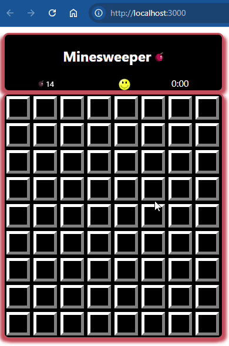

# stage-5-of-5-final-touches | [readme](../readme.md)

## [Final touches](https://hyperskill.org/projects/108/stages/590/implement)

### Tasks
* DONE: the number of flags should be the same as the number of mines
* DONE: set the number of mines to be related to the 
size of the field (20% of cell count)
* DONE: if you click on a mine - decorate ALL mine cells, not yet flagged as having a mine
* DONE: if you click on a closed cell having zero nearby mines, then perform a flood fill starting at this location
* DONE: After each move, evaluate the field to determine if a victory condition exists - remember, _**a victory happens when all cells are opened and all mines are flagged**_.
* DONE: if you click on a closed cell and it has 1 or more nearby mines, then set the marker to this cell to the number of mines, open the cell - but DO NOT flood surrounding cells

### Discussion and understanding of Minesweeper in this stage | [rules](https://www.gamesver.com/minesweeper-explained-how-to-play-rules/)

### Description
Wow! You are one stage away from completing the project!

To complete this final stage, we recommend using [**lifecycle methods**](https://www.w3schools.com/react/react_lifecycle.asp). An alternative way is Hooks, which were added to React to provide a more direct API to such concepts as props, state, context, refs, and lifecycle. Even though in general, **Hooks** may be a better tool, you'll need to rewrite a big portion of your code if you want to use it now. Because of that, and since lifecycle methods are a part of React, it would be better to leave Hooks for later and opt for [lifecycle methods](https://www.w3schools.com/react/react_lifecycle.asp) in this project.

As described earlier, victory comes after all cells are open and all bombs are flagged. Implement a function that will track it and show that you've won.

Add the reset function that should be launched if the player presses the reset button. Bring some variety to the reset button appearance: change it according to the situation on the field! Check out the example to see how we did it.

Almost there! It's a good idea to add code that will prevent losing after the first click. In other words, if the player's first click was on a cell with a mine, you should call the function to create a new field. The first click shall never be on a mine: it's a classic Minesweeper rule! Finally, make sure that after the game is over, all the mines are displayed on the field.

That's it! You have your own unique version of Minesweeper!

Your intermediate solution can be compiled and run in a browser using the `npm start` command in the WebStorm terminal; to stop the server, use `Ctrl+C`.

### Objectives
* Reset button
* Remake the field if the first click was on a mine
* After the game is over, all the mines are shown
* Victory condition

### Examples
In a browser, the result of this step will look something like this:

