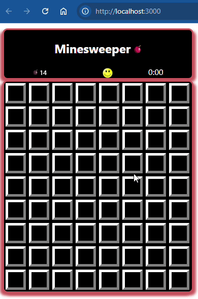

# [minesweeper-with-react](https://bitbucket.org/kroubalkian/minesweeper-with-react) | [Hyperskill](https://hyperskill.org/projects/108)



## Stages
* DONE [stage 1/5 : Minesweeper is loading...](./docs/stage-1-of-5-minesweeper-is-loaded.md)
* DONE [stage 2/5 : Are you a designer?](./docs/stage-2-of-5-are-you-a-designer.md)
* DONE [stage 3/5 : The main characters: cells](./docs/stage-3-of-5-the-main-characters-cells.md)
* DONE [stage 4/5 : Functionality](./docs/stage-4-of-5-functionality.md)
* DONE [stage 5/5 : Final touches](./docs/stage-5-of-5-final-touches.md)
---

## tasks
* DONE [install nodejs](./docs/install-nodejs.md)
* DONE [setup-react-project](./docs/setup-react-project.md)


## resources
* [TagCloud](https://www.npmjs.com/package/TagCloud) | [react examples](https://madox2.github.io/react-tagcloud/)
* [Debugging in VS Code](https://jestjs.io/docs/troubleshooting#debugging-in-vs-code)
  * edit (or create) file `${workspaceFolder}/.vscode/launch.json`
  ```
  node --inspect-brk node_modules/.bin/jest --runInBand [any other arguments here]
  or on Windows
  node --inspect-brk ./node_modules/jest/bin/jest.js --runInBand [any other arguments here]

  node --inspect-brk ./node_modules/jest/bin/jest.js --runInBand floodFill2DArray.test.js
  ```
* [MEDIUM: How to Debug Jest Tests in VS Code?](https://medium.com/@akkutyagi/how-to-debug-jest-tests-in-vs-code-8594b7ea02dc)
  * create a launch configuration
* [play minesweeper online](https://minesweeperonline.com/)
* [nodejs home](https://nodejs.org/en)
    * `node --version` : v20.11.1
    * `npm --version` : 10.8.2
    * `npx --version` : 10.8.2
* [reactjs home](https://react.dev/) | [hooks](https://react.dev/reference/react/hooks)
* [How to test a react app with jest and react testing library](https://www.digitalocean.com/community/tutorials/how-to-test-a-react-app-with-jest-and-react-testing-library) - includes mocking fetch calls
    ```
    git clone https://github.com/do-community/doggy-directory
    ```
* React Testing frameworks
  * [Enzyme](https://github.com/enzymejs/enzyme)
  * [Jest](https://jestjs.io/) - is a JavaScript test runner that provides resources for writing and running tests.
    * by default [Jest](https://jestjs.io/) will look for files with `.test.js` suffix
      and files with the `.js` suffix in the `__tests__` folders. When you make
      changes to the relevant test files, they will be detected automatically.
  * [React Testing Library](https://testing-library.com/docs/react-testing-library/intro/) - offers a set of tesitng helpers that structure your tests based on user interactions rather than components' implementation details.
  * [React testing cheatsheet](https://testing-library.com/docs/react-testing-library/cheatsheet/#queries)